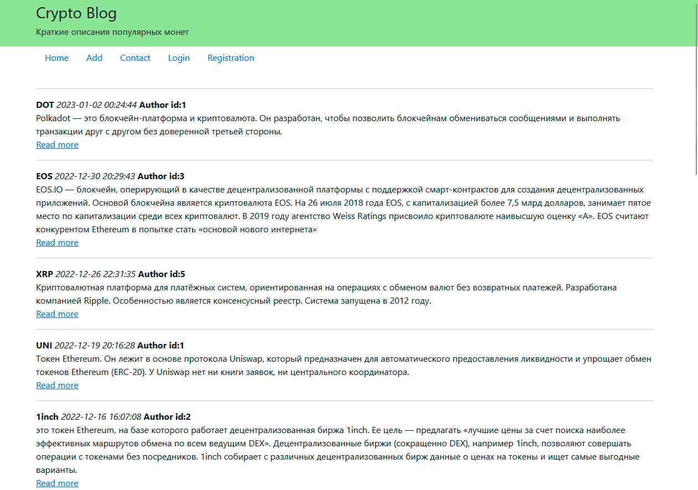

# Криптоблог на чистом php
___

___
## Описание проекта

### В проекте реализована модель MVC, основные группы контроллеров отвечают за статьи и категории статей. Создана одна точка входа и один файл подключения init.php. Внедрен ЧПУ, URL адреса указываются в файле routes.php. В .htaccess прописаны соответствующие запреты.
### Подключение шаблонов реализуется через функцию template, которая принимает на вход путь до подключаемого файла и переменные, которые необходимо передать в подключаемый файл.
### Основные страницы отображения контента "собираются" из нескольких шаблонов, один из которых отвечает за центральную часть сайта, а другой за боковую колонку слева. Сборка происходит в файле base/v_con2col.php
### Доступна форма регистрации, с минимальными проверками по корректности заполнения полей. Зарегистрированный пользователь добавляется в базу, с возможностью повторного логирования. При авторизации на сайте, посетитель может отметить чекбокс "запомнить меня", тогда подключается cookie с названием "token", благодаря которой пользователь может повторно заходить в свой аккаунт в течении месяца, без необходимости повторного логирования. Авторизованным пользователям доступна кнопка logout, удаляющая cookie из базы. Так же проверки присутствуют при добавлянии новых статей и категорий на сайт.
___
## Функционал

### 1. Не зарегистрированные пользователи могут читать статьи. У них нет возможности добавлять, удалять и редактировать статьи.
### 2. Зарегистрированные пользователи могут добавлять статьи и новые категории, а так же удалять и редактировать свои статьи и категории.
### 3. На сайте ведутся логи, их может просмотреть только администратор.
___
## Установка проекта

### 1. Необходимо скачать локальным веб-сервер, например XAMPP
### 2. Открыть программу и запустить модули Apache и MySQL
### 3. Перейти в браузере по адресу localhost
### 4. Скачать базу данных cryptoblog.sql из ветки проекта и импортировать в phpmyadmin
### 5. Скачать и разместить остальные файлы из ветки в папке xampp\htdocs\PHP\PHP-BLOG\ на компьютере 
### 6. Перейти в браузере по адресу localhost/PHP/PHP-Blog/  
### 7. Для просмотра логов нужно войти под администратором login: admin pass: 12345 
### Если всё сделано правильно, проект должен быть доступен. XAMPP должен быть запущен
